# 📦 Intelligent Robotic Medicine Storage System – ASQII HealthTech

Final Year Project – Computer Vision & Robotics  
ASQII HealthTech | Tunis, Tunisia | 2024–2025

---

## 🎥 Project Demonstration

### 1️⃣ Computer Vision Pipeline (GIF)

### 2️⃣ Robotic Storage System (GIF)

### 🖼️ OCR Extraction Example
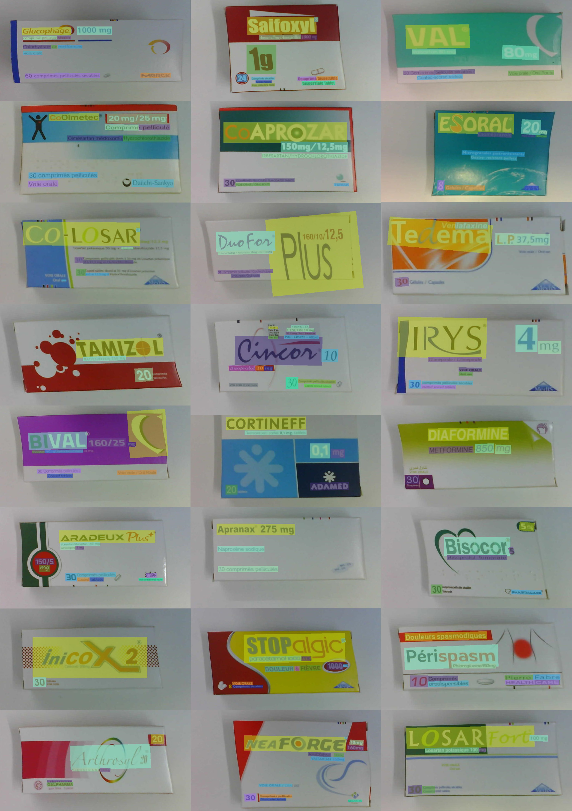

---

## 🚀 Project Overview

This final-year project was carried out within the startup **ASQII HealthTech**.  
Its goal is the **design and implementation of an automated intelligent storage system for pharmaceutical products** using computer vision and robotics.

The work is structured around **two major components**:

---

## 📌 1. Computer Vision Pipeline (OCR-Based Medicine Recognition)

A complete CV pipeline was developed to:
- Detect medicine boxes in captured images
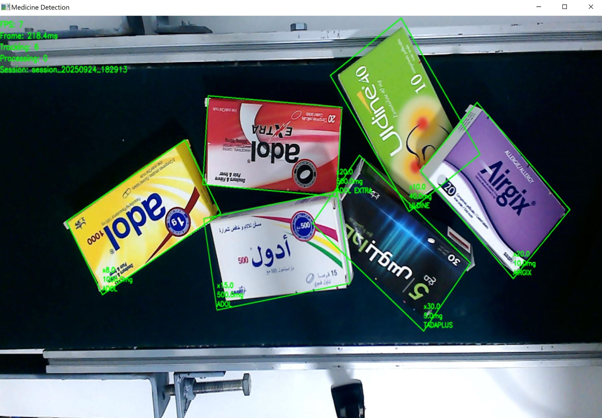
- Correct orientation and unwarping
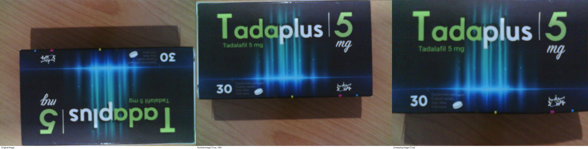
- Extract text using **OCR**  
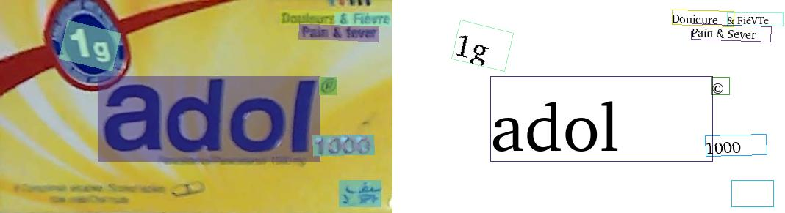
- Identify medicine names, dosages, and quantities  
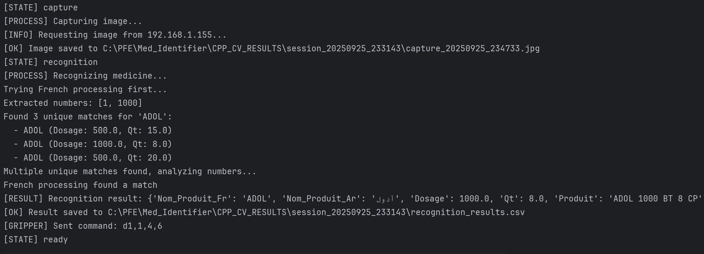
- Match results against a pharmaceutical database  
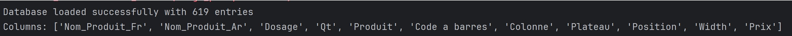

This module enables **high-accuracy recognition** even from noisy or rotated images.

### 📊 OCR Performance Summary

| **Criterion**                   | **Result (French OCR)** | **Result (Arabic OCR)** |
|--------------------------------|---------------------------|---------------------------|
| Number of tested images        | 310                       | 140                       |
| Full Match Rate                | 90.0%                     | 91.4%                     |
| Partial Match Rate             | 6.1%                      | 4.3%                      |
| No Match Rate                  | 3.9%                      | 4.3%                      |
| Success Rate                   | 93.87%                    | 6.13%                     |
| Error Rate                     | 92.14%                    | 7.86%                     |
| Total processing time          | 3 min 55 s                | 3 min 15 s                |
| Average time per image         | 0.758 s                   | 0.964 s                   |
| GPU Usage (VRAM)               | < 2 GB                    | < 2 GB                    |

This test evaluates the full computer vision pipeline—from ESP32-CAM image capture to OCR extraction and database matching. Each image represents a unique medication case with variations in language, dosage, and quantity. The dataset contains both Arabic and Latin text, and all images include usable information. Processing was executed on a laptop.

---

## 📌 2. Automated Storage Robot (Cartesian XY System)

The second part of the project focuses on an automated robotic storage system based on:
- A **Cartesian XY robot**

- A **gripper** for box handling  
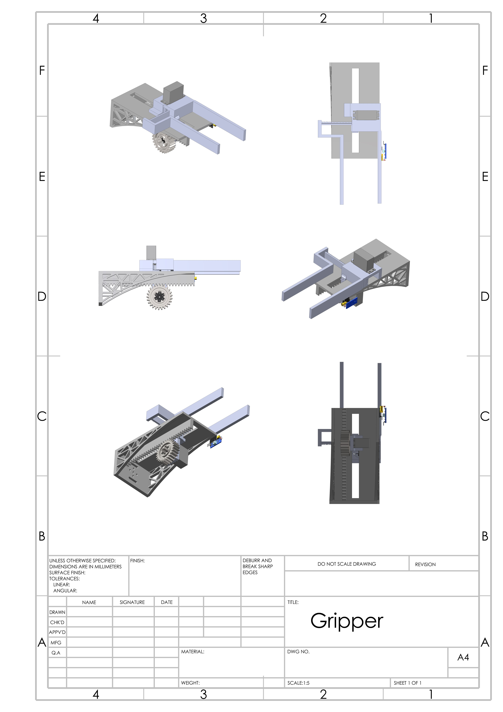
- Motion control using **ESP32-based boards**  
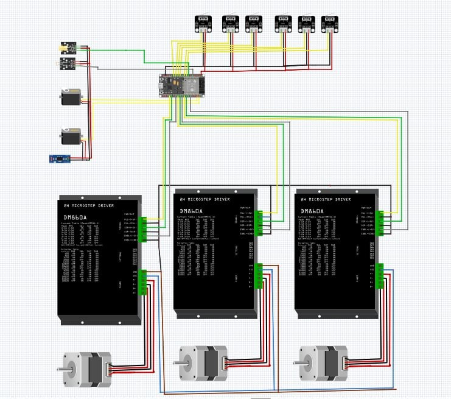
- Task execution after receiving commands from the CV pipeline  

The robot:
➡️ X and Y axis calibration using limit switches
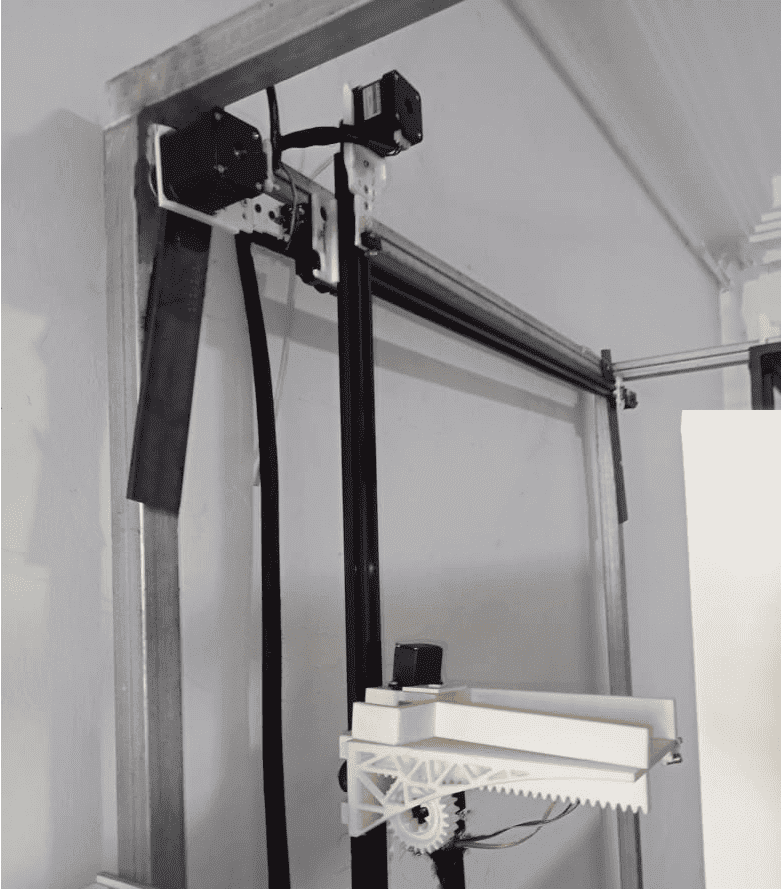
➡️ Accurate scanning and recording of dividers to store the position of each compartment using a laser
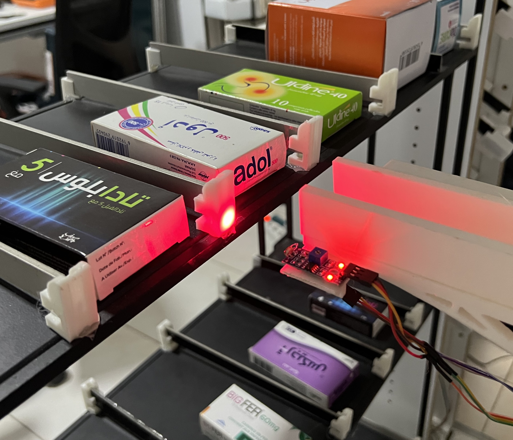
➡️ Retrieves the identified medicine  
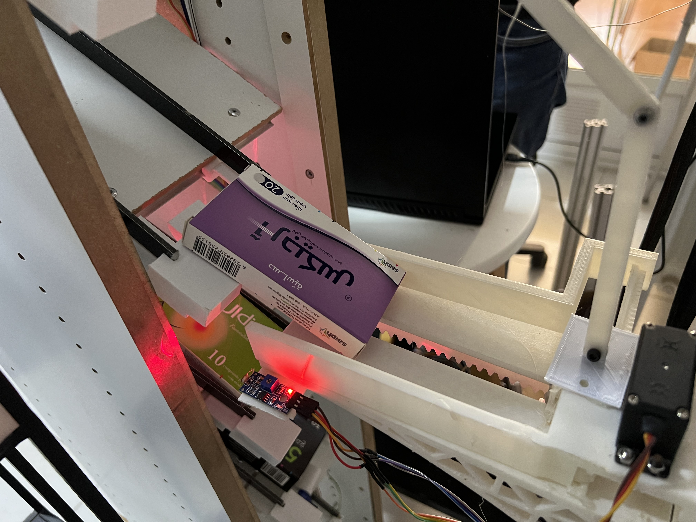
➡️ Moves it to the appropriate storage location  
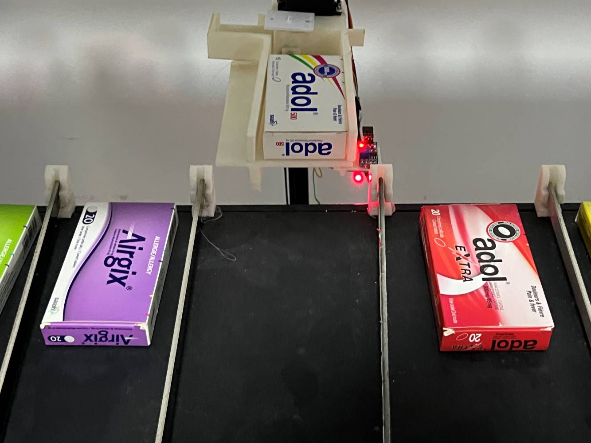
➡️ Places it safely inside the cabinet  
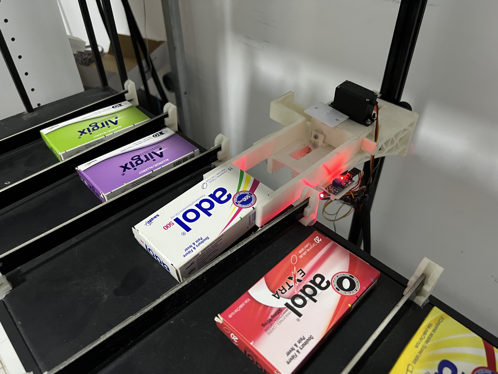
This ensures **fully automated and reliable operation**.

---

## 🔄 System Communication

All modules communicate via a **secure MQTT protocol**, enabling:
- Real-time coordination  
- Reliable message transmission  
- Scalability for modular expansion  

---

## 🧪 Development Methodology

The project followed the **Agile SCRUM methodology**, integrating:
- Computer Vision development  
- Mechanical design of the XY robot  
- PCB & electronic design based on ESP32  
- MQTT and communication protocol 
- Iterative testing and refinement  

---

## 🧠 Tech Stack

- **Computer Vision:** Python, OpenCV, OCR, YOLO/OBB models  
- **Robotics:** ESP32, Stepper motors, Endstops, Gripper  
- **Communication:** MQTT (secure), JSON messaging  
- **Embedded Electronics:** PCB design, sensors & actuators  
- **Mechanical:** Cartesian robot, custom gripper  

---

## 📚 Keywords

Computer Vision · OCR · Cartesian Robot · MQTT · Pharmaceutical Automation · ESP32 · Sensors & Actuators · Robotics · Embedded Systems

---

## 📚 More Videos of the Prototype

https://drive.google.com/drive/folders/1rWNkGL16mq7j9nAlx2hy_UhUSQMlzgM9?usp=sharing

## 📚 Useful Documentation

- **PADDLE OCR**  
  [https ://github.com/PaddlePaddle/PaddleOCR](https://github.com/PaddlePaddle/PaddleOCR.git)

- **EASY OCR**  
  https://www.jaided.ai/easyocr/

- **TESSERACT OCR**
  [https ://github.com/tesseract-ocr/tesseract](https://github.com/tesseract-ocr/tesseract.git)

 - **ULTRALYTICS (for YOLO detection)**
   https ://docs.ultralytics.com/

 - **RapidFuzz**
   https ://rapidfuzz.github.io/RapidFuzz/
   
- **MQTT**
  https://docs.oasis-open.org/mqtt/mqtt/v5.0/mqtt-v5.0.pdf
  
- **ESP32**
  https://documentation.espressif.com/esp32
  
- **STEPPERS**
  [https://www.orientalmotor.com/stepper-motors/index.html](https://www.orientalmotor.com/stepper-motors/)

